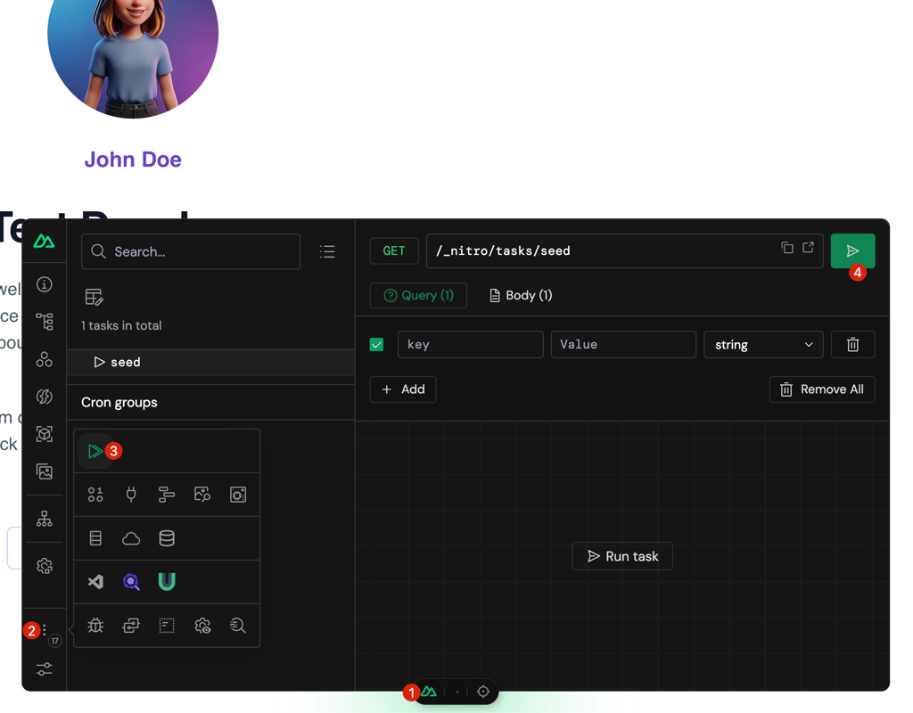

## Setup

Make sure to install dependencies:

```bash
# npm
npm install
```

## Development Server

Start the development server on `http://localhost:3000`:

```bash
# npm
npm run dev
```

## Production

Build the application for production:

```bash
# npm
npm run build
```

Locally preview production build:

```bash
# npm
npm run preview
```

## Database Migration

Current database schema


1. Create/update database schema: 
   - `server/database/schema.ts`
2. Generate the migrations based on `server/database/schema.ts`: 
   - `npm run db:generate`
3. Once the `npm run dev`/`npm run build` command is executed, the database will be locally created under the below path:
   - `.data/hub/d1`

## Create Test Post(s)

Look for the Nuxt Task Runner devtools item with the “play” looking icon (it might be under the vertical ellipsis) on
the left-hand side of the devtools and press the "send" button to execute your task!



PD: This script only creates the Post record(s). It doesn't create the `category`, `post_category`, `tag`, and
`post_tag` records which are optional